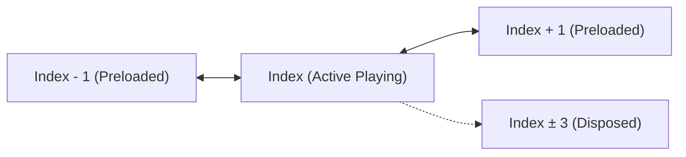

# Flutter Reels Demo

A high-performance, smooth, and customizable Flutter Reels / Shorts viewer inspired by Instagram Reels and TikTok.

---

## ✨ Features

- 📱 **Smooth Vertical Swiping**: Powered by `card_swiper` with `AlwaysScrollableScrollPhysics` for non-blocking navigation.
- 🎬 **Smart Video Controller Lifecycle**:
  - Auto-play on focus and automatic pause/reset on swipe away.
  - Pre-buffering for adjacent reels (`index - 1` and `index + 1`) for zero-delay transitions.
  - Automated memory cleanup disposing controllers outside active range (`|distance| > 2`).
- ⏯️ **Tap-to-Play/Pause**: Interactive tap toggle with animated play overlay.
- 🛡️ **Graceful Error Handling**: Error state with a "Retry" button when network streams fail without locking or blocking reel navigation.
- 💬 **Reel Interaction Overlay**:
  - Profile avatar & username with verified badge.
  - Follow button toggle.
  - Formatted Like count & Comment count (compact currency format, e.g. `2.5K`).
  - Interactive Comment Bottom Sheet with animated items.
  - Share & More options actions.
- 🎨 **Status Bar Integration**: Transparent status bar with adaptive light system overlay icons.

---

## 📦 Dependencies

Ensure the following dependencies are added to your `pubspec.yaml`:

```yaml
dependencies:
  flutter:
    sdk: flutter
  cupertino_icons: ^1.0.9
  cached_network_image: ^3.4.1
  card_swiper: ^3.0.1
  intl: ^0.20.3
  video_player: ^2.11.1
  animate_do: ^5.1.0

dependency_overrides:
  sqflite_android: 2.4.1 # Ensures compatibility with Android compileSdk 35
```

---

## 🚀 Getting Started

### 1. Prerequisites
- Flutter SDK `^3.10.7` or newer (or FVM)
- Dart SDK `^3.10.7`

### 2. Installation & Run

1. **Clone the repository:**
   ```bash
   git clone https://github.com/prodev-mob/reels_app.git
   cd reels_app
   ```

2. **Install dependencies:**
   ```bash
   flutter pub get
   # or with FVM
   fvm flutter pub get
   ```

3. **Run on an Emulator or Physical Device:**
   ```bash
   flutter run
   # or with FVM
   fvm flutter run
   ```

---

## ⚙️ Architecture & Video Lifecycle



1. **Initial Load**: Initializes and starts playback for `index 0`, while pre-warming `index 1`.
2. **On Page Change (`index`)**:
   - Pauses and seeks back any non-active controllers immediately.
   - Cleans up / disposes distant controllers (`|idx - current| > 2`) to minimize RAM consumption.
   - Initializes and plays the current index.
   - Pre-warms `index + 1` and `index - 1` in the background.

---

## 🎥 Demo Video

https://github.com/prodev-mob/reels_app/assets/97152083/61b0a99d-b7b5-4657-b427-a66a9bb65cf6

---

## 📄 License

This project is licensed under the MIT License.
